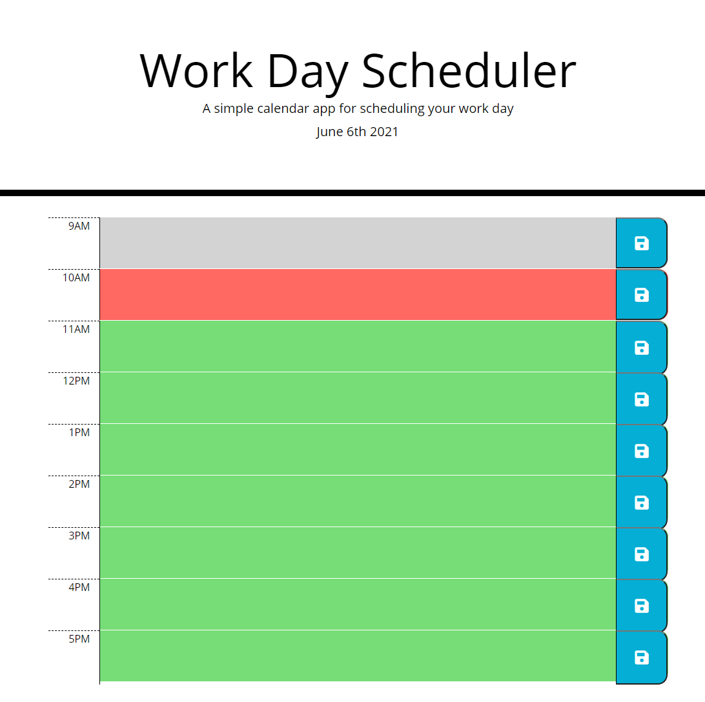

# WashU Bootcamp Homework, Week Five

## Table of Contents

I. Description
II. Project screenshot
III. Link to deployed page

## I. Description

Week five homework.  
Creating a day planner using the provided mock-up and Acceptance Criteria.
Creating a repository on Github, and deploy the page to a live URL.
Acceptance Criteria include:
Current day displayed at the top of the page.
Time blockes for standard business hours, color coded to indicate whether the hour is in the past, present or future.
Being able to click into a time block and enter an event.
Saving events into local storage so the events persist.
Uses a date utility library to work with date and time.

## II. Project screenshot

## III. Link to deployed page

https://mikechampion.github.io/day-planner/
